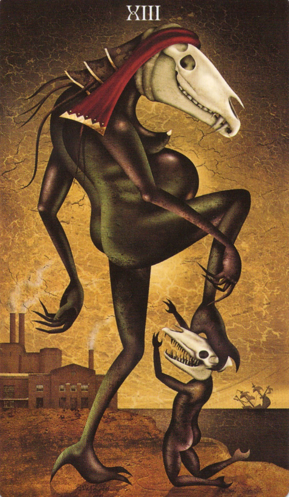

## 🧭 概要

このワークは、過去の自分を手放し、次の段階へと移行するための儀式です。
Deathカードを「扉」として、アサメイを「鍵」として使い、通過儀礼を体験します。

# Keys of Transition

## 🛑 Opening the Temple of the Crossroads

> **O Hekate, Keeper of the Thresholds,**  
> I stand at the edge of shadow and flame.  
> By your threefold torch, I call this place sacred—  
> A temple not of stone, but of will and silence.  
>  
> **I open the circle within,**  
> The inner gate of crossroads unseen.  
>  
> **Come, Lady of the Ways,**  
> Guide my steps between the worlds.  
>  
> （ヘカテよ、しきいの守り手よ——  
> 影と火の境にて私は立つ。  
> 三つの松明を掲げ、ここを聖域とする。  
> これは石の神殿ではなく、意志と沈黙の神殿。  
> 内なる円を開き、  
> 見えざる交差点の門をひらく。  
> 道の女神よ、  
> 世界と世界の間を歩む私を導いてください。）

*Draw an opening pentacle with your ritual tool. If using a wand, start from the top point to the lower left.*  

## 🔮 Ritual

> I see a door—silent, sealed, unmoving.
> I know what lies behind it: something I have clung to.

> I place the Death card before me.
> It stands as the lock—the ending that bars the way.

> In my hand, I hold the key: my athame.

> Hekate, Guardian of Thresholds,
> Let me walk through what must be ended.

> I raise the blade and turn it in the air,
> unlocking what I am ready to release.

> With this breath, I surrender what is done.
> With this step, I claim the path ahead.

> The door opens—not by force, but by release.
> I pass through in silence, and the world is new.

> 扉がある——黙し、封じられ、動かない。
> その向こうには、私がしがみついてきたものがある。

> Deathのカードを前に置く。
> それは道を閉ざす「錠（ロック）」——終わりの象徴である。

> 私の手には鍵がある。アサメイだ。

> 境界の守り手、ヘカテよ、
> 終えるべきものの中を、私が通れるように。

> 刃を掲げ、空中でそっとまわす。
> 私が手放すべきものを、鍵で解き放つように。

> この息とともに、過去を手放す。
> この一歩とともに、新たな道を選ぶ。

> 扉は力でなく、解放によって開かれる。
> 私は沈黙の中で通り抜け、新たな世界に至る。

## 🔚 Closing the Circle of the Work

> **O Hekate, Flame of the Crossroads,**  
> The work is done, the circle sealed.  
> What was opened with will, I close with grace.  
>  
> **Let what was true remain,**  
> Let what was illusion fall away.  
>  
> The path stands clear, and I walk on.  
> So mote it be.  
>  
> （交差点の炎であるヘカテよ、  
> 作業は終わり、円は閉じられる。  
> 意志で開いたものは、美しさで閉じる。  
> 真実は残り、幻想は去る。  
> 道はすでに明らかであり、私はそれを歩む。  
> そのようになりますように。）

*Draw a closing pentacle, starting from the lower left to the top point.*

## 🖼️ Tarot Card Reference

## 🔓 ライセンス

このプロトコルは非商用・改変自由・クレジット表記のもと、Creative Commons BY 4.0にて公開されています。
Ravensgateプロジェクトの一環として、本棚神殿と現代的ツールによる個人の内的成長と魔術実践を支援する目的で設計されています。
